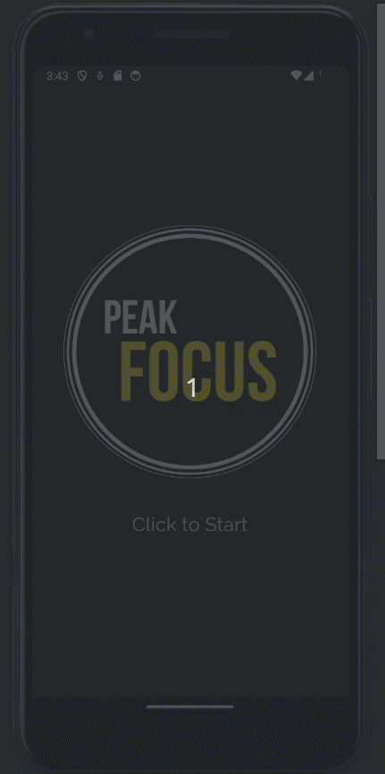

# PEAKFocus

Welcome to the **PEAKFocus** repository! This is the home of the **PEAKFocus** application, a project developed at [START Munich's 24h Hackathon 2023](https://www.linkedin.com/events/24hourhackathon-sportsandhealth7073922193423781888/about/) by team **PEAKFocus**:
- Shaurya Sharma, @shauryainf
- Philipp Wulff, @philippwulff
- Fabian Mast, @fabianmast
- Oliver Klukas, @OliverKlukas

# Challenge
Proposed by [brainboost](https://brainboost.de/en/) our great company partner for the hack, they gave this [challenge](https://www.linkedin.com/feed/update/urn:li:activity:7074671365953335296/):

Create an innovative software prototype that seamlessly integrates with brainboost's diverse product portfolio of live Neurofeedback and EEG data for atlethe training and state-of-the-art technology infrastructure.

# Product at a glance
**PEAKFocus** is a mobile app that allows athletes to train their **focus in the most important moments** of their game. Many athletes internalize a *routine* to achieve and maintain focus during competitions. Our solution improves the training of these routines by providing feedback from a brain interface. More specifically, athletes are challenged to reduce the volume of a control sound through staying in a *focused state of mind* (which we measure via their brain activity) while doing their routine. The result is a more achievable, robust and retainable routine.

Check out our [pitch](assets/PeakFocusPitch.pdf) for more details.

# Technical Documentation

## Project Structure

## Pre-requisites & Dependencies

## Installation

